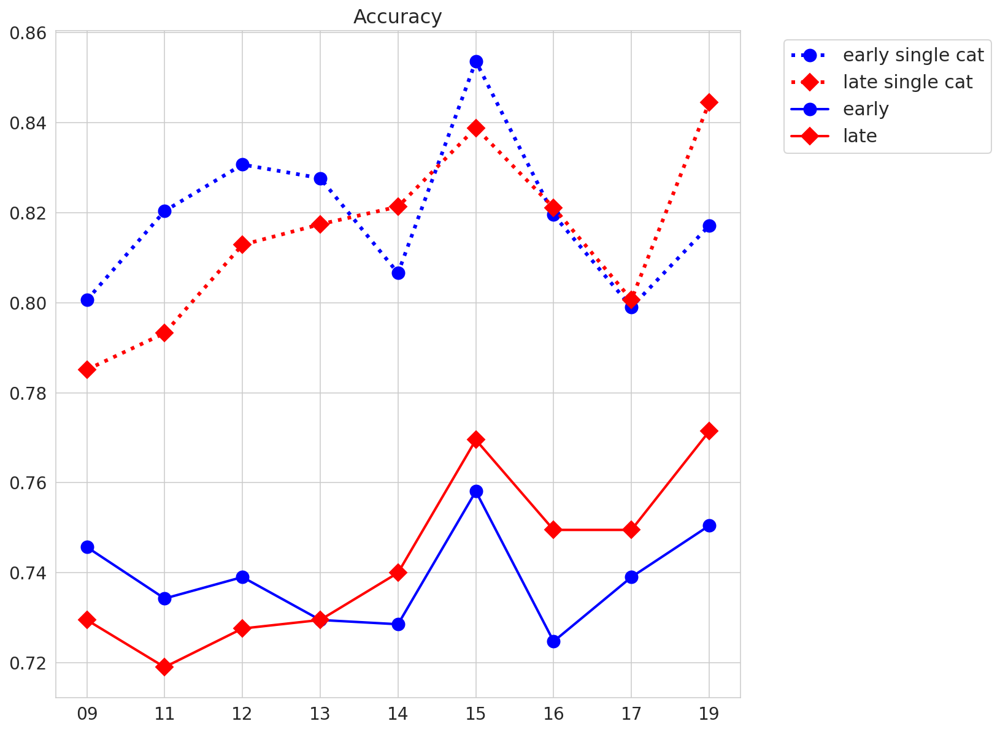
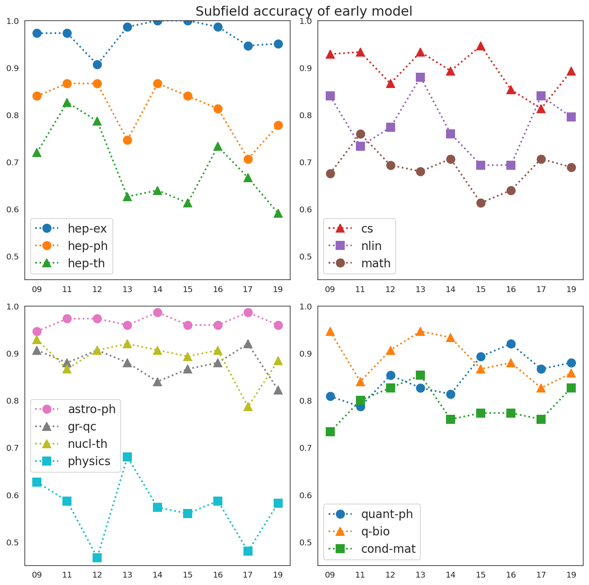

# Dear Theoretical Physics, if we pass each other on the street in 10 years, will we even recognize each other?

As I bid a fond farewell to academia, and an enthusiastic 'Hello' to *world*, I
face the same questions that many have faced before me: "Am I starting over?
"What will I do? will it be fascinating, challenging, and rewarding?" "Should I 
still call myself a physicist?" In this project, I would like to focus on the 
question of my status as a physicist.  **The idea, as the title suggests, is to
ask whether 10 years of progress will render theoretical physics unrecognizable.**
I am currently an expert in theoretical cosmology and string phenomenology, and
very-well versed in high energy theoretical physics in general, but for how long?

To answer this question, I will train a new expert, not just in high energy 
theory, but in all subfields of physics. At least, **I will train an expert AI
to recognize and classify the abstract of a physics paper into its appropriate 
subfield.** Then, I will train this AI specifically using physics papers
published to the [arXiv](http://arxiv.org) in, say, 2008, and see how well this
AI performs on classifying papers published in 2018.

Other than answering questions pertaining to my current identity revolution 
(definitely not a crisis,) this type of analysis might be of interest to:
- **The history of physics:** this tool has the ability to **quantifiably 
  identify paradigm shifts** -- pivotal points where the face of a field shifts
  so much that it becomes unrecognizable to experts of the past.
- **Journalists:** it's best to write articles about exciting, developing fields, but
  it is not necessarily easy for non-experts to identify which fields are progressing
  the fastest.  **This tool allows one see how many subfields are changing over
  time at a glance.**
- **Grant writers:** citation volume can vary widely over subfields, and furthermore
  can be the result of fads more-so than long-lasting impactful papers.  This 
  analysis could supplement citations as a quantifiable indication that work in
  a certain year had major impact on the field. Extending this work with a
  **principal component analysis**, which identifies the most important words in
  describing a subfield, would further serve this purpose. 
- Another possible use is to help extremely indecisive authors who simply cannot
  decide which arXiv category to submit to; just download the model, feed it your 
  abstract, and let the expert decide where your submission fits best.

## Method

I use the pretrained [bert-base-cased model](https://github.com/google-research/bert)
provided by Google and the [Transformers library](https://huggingface.co/transformers/)
provided by Hugging Face. The architecture as well as intuitive descriptions of
how all the pieces work are provided by [this tutorial](https://curiousily.com/posts/sentiment-analysis-with-bert-and-hugging-face-using-pytorch-and-python/).
I train the AI to recognize physics subfields on Google Colab's GPUs. Thanks everyone!
 
### Other tools
- PyTorch: provides all the deep learning tools and interfaces with automatically
with bert.
- Dask.bag: provides familiar manipulation tools for dealing with the massive (2.9GB)
arXiv metadata dataset with a small memory footprint.
- All the usual suspects: pandas (dataframe manipulation,) sklearn (handy tools for 
  setup and metrics for evaluation,) seaborn (pretty plots.)

So let's clean and separate the data into the various training sets, fine tune
the bert models -- choosing hyper-parameters such as learning rate, batch size,
and training epochs -- and collect and analyze the results.

## Data

The arXiv has revolutionized the way we do physics. All physics papers are put 
onto the arXiv and everyday physicists browse their particular subfield like a
newsfeed, checking out the latest developments.  All papers are submitted to at
least one subfield, but may be cross-listed to other subfields.

The subfields (also referred to as categories) that my AI can classify are:
<table border="0">
 <tr>
    <td> - astro-ph = Astrophysics  
         - cond-mat = Condensed Matter  
         - gr-qc = General Relativity and Quantum Cosmology  
         - hep-ex = High Energy Physics - Experiment   
         - hep-ph = High Energy Physics - Phenomenology   
         - hep-th = High Energy Physics - Theory   
         - math-ph = Mathematical Physics   
    <td>- nlin = Nonlinear Sciences   
        - nucl-th = Nuclear Theory   
        - physics = Physics   
        - quant-ph = Quantum Physics   
        - math = Mathematics   
        - cs = Computer Science   </td>
 </tr>
</table>

In cleaning the data I:
- removed sub-sub-fields, e.g. astro-ph.co (cosmology and nongalactic astrophysics)
  and astro-ph.ga (astrophysics of galaxies) are lumped together in astro-ph.
- Threw out a few subfields that did not consistently have enough submissions/year:
  High Energy Physics-Lattice, Nuclear Experiment, Statistics, Quantitative Finance,
  Electrical Engineering and Systems Science, and Economics
- Clean up newline and other special characters and replaced all LaTeX mathematical
  equations with the word 'equation'.
  
The data (i.e. the abstracts and their associated categories) was then split by
year, with each year being balanced w.r.t. the categories. It was important to 
keep the dataset balanced (keep same number of papers for each category for each)
year, because I'd like to compare the accuracy of the model across categories.
If the model finds it relatively difficult to classify astro-ph papers, I'd like that 
to be due to the content of the papers, and not due to a deficit in the training data.

## Training

I trained two models: the "early" and the "late" model.  The **early model was 
trained using a dataset of papers from 2008, 2009, and 2010**. The **late model
was trained using papers from 2018, 2019 and 2020**. A span of three years was 
used to increase training set size and prevent overfitting the data.  Each dataset
was balanced across categories and contained 21,000 abstracts which were then 
divided using a 90/5/5 split for training/validation/test sets (retaining balance
across categories.)

To prevent overfitting I used a dropout rate of .5, and also used an early stopping
condition if the validation loss increased by 30% from its initial value.  

## Results

I evaluate the models on the test set separated out from the training data, and
also on equally sized and balanced datasets comprised of papers from each of the
intervening years: 2011-2017.  The results bear out the naive expectation, the 
early model is better at classifying papers in the beginning of the intervening
years, and the late model is better towards the end, with a cross-over at 2013.  
The models are "pretty good" with the early model getting 74.6% correct on the 
early papers, and the late model getting 77.1% correct on the late papers.  
However, for the 14 categories we are classifying, this is over 10 times better
than random.  Also, these are highly technical texts with a lot of jargon; I would
be interested to know my own accuracy... but I don't have time to read all those
abstract right now.

One subtlety is the fact that some papers are only submitted to one subfield, 
whereas many papers submitted to a main subfield and then cross-listed to several
others.  These latter papers may straddle sub-fields and make classifying difficult,
whereas single-category submissions should be more representative of their category
and therefore easier to classify. Indeed, accuracy is substantially higher for 
single-category submissions.

A clear extension of this project is to make a multi-label classifier to pick up
the cross-listed categories. This would be a simple matter of adding some labels
and removing the softmax function.  However, for this project I am more interested
in looking at the evolution of the subfields and therefore looking at single-category
submissions is a better indicator. (This of course misses trends associated to 
two subfields coming together and suggests a possible extension.)

To look at the evolution of subfields I evaluated the early model on a test sets 
containing only single-category submissions from each of the intervening years.  
The accuracy per category data is shown below.

A subfield accuracy staying flat may be interpreted as stagnation, while accuracy
decreasing rapidly and steadily may indicate progress. Meanwhile, sharp dips in
accuracy which only las for a year appear to be fads.  The odd case of accuracy
increasing steadily perhaps indicates that a major event happened directly before
the early model years and coming to dominate the field more and more.  As mentioned
above a principal component analysis as a function of year would provide much
more insight into the underlying source of perceived fads and progress.